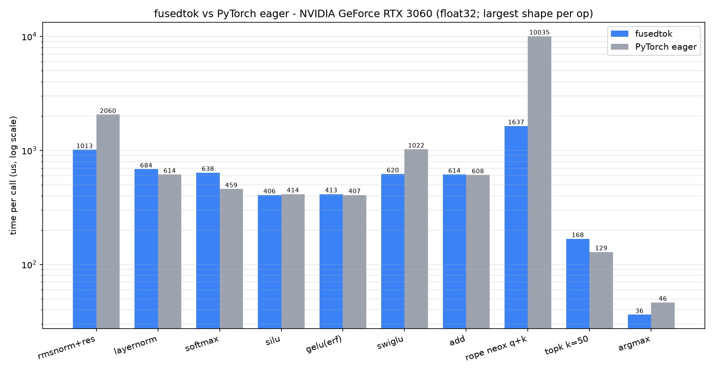

# fusedtok

**Fused CUDA kernels for LLM inference** — RMSNorm / RoPE / SwiGLU, one `pip install` away.

**中文文档请看 [README_zh.md](README_zh.md)** | English below.

## Why

LLM inference frameworks launch many small, memory-bound operators per token. Each launch
round-trips through global memory. `fusedtok` fuses them into single kernels to cut memory
traffic and launch overhead.

## Operators

| Status | Kernel | Notes |
|---|---|---|
| ✅ | RMSNorm (+residual) | LLaMA/Qwen style, fused residual add |
| ✅ | LayerNorm | with affine |
| ✅ | RoPE | interleaved **and** NeoX layouts, kv-cache `pos_offset` |
| ✅ | SwiGLU | fused MLP activation |
| ✅ | Softmax (row-wise) | numerically stable |
| ✅ | SiLU / GeLU / GeLU-tanh / ReLU / Tanh / Sigmoid | elementwise |
| ✅ | add / mul | elementwise binary (fused add+residual pattern) |
| ✅ | top-k / top-p (nucleus) | deterministic ties |
| ✅ | argmax / temperature | greedy decoding helpers |
| ✅ | repetition penalty | CTRL-style, applied to sampled token ids |
| ⏳ | INT8/FP8 quantized path | planned v0.3 |

## Install

```bash
pip install fusedtok   # not yet published — building from source until v0.1
```

Build from source:

```bash
git clone https://github.com/Hai-Wenxiang/fusedtok.git
cd fusedtok
pip install .
```

**Requirements:**

- NVIDIA GPU of **RTX 30 series (Ampere) or newer** — e.g. RTX 3060/3090, RTX 4080, RTX 5090, A100, H100
- CUDA Toolkit >= 12.0

<details>
<summary>What is "compute capability"? (click to expand)</summary>

Compute capability is NVIDIA's version number for a GPU architecture generation — not a
performance score. CUDA code must be compiled for a specific architecture to run on it.
Kernels in this library target compute capability 8.0+ because features they rely on
(e.g. `__nv_bfloat16`) only exist from that generation on.

| Compute capability | Architecture | Example GPUs |
|---|---|---|
| 7.5 | Turing | GTX 16xx, RTX 20xx |
| 8.0 / 8.6 | Ampere | A100, RTX 30xx |
| 8.9 | Ada | RTX 40xx |
| 9.0 | Hopper | H100 |
| 12.0 | Blackwell | RTX 50xx, B200 |

Check yours: run `nvidia-smi` to see your GPU model, then look it up at
https://developer.nvidia.com/cuda-gpus

</details>

## Usage

numpy in / numpy out, or torch in / torch out — including **zero-copy CUDA**:
kernels read and write torch device buffers directly via `data_ptr()`, with
no staging copies and no host synchronization.

```python
import numpy as np
import torch
import fusedtok

x = np.random.randn(4, 1024).astype(np.float32)
w = np.random.rand(1024).astype(np.float32)

# CPU reference implementation (ground truth, runs anywhere)
y = fusedtok.rmsnorm(x, w, eps=1e-6)

# staged CUDA: copies to GPU, runs kernel, copies back
y = fusedtok.rmsnorm(x, w, cuda=True)

# zero-copy CUDA with torch tensors: kernels run in torch's own buffers,
# stream-ordered with other torch operations
xt, wt = torch.from_numpy(x).cuda(), torch.from_numpy(w).cuda()
yt = fusedtok.rmsnorm(xt, wt)          # -> CUDA torch tensor

# RoPE with kv-cache position offset, NeoX (LLaMA-HF) layout
q = torch.randn(1, 4096, device="cuda")          # new token only
q_rot, k_rot = fusedtok.rope(q, k=None, pos_offset=1023, neox=True)

# sampling side
logits = fusedtok.repetition_penalty(logits, sampled_ids, penalty=1.1)
values, indices = fusedtok.topk(logits, k=50)
```

Every function accepts float32 numpy arrays or torch tensors (other dtypes
are converted with a copy) and returns float32 outputs of the same family.
CUDA torch tensors select the zero-copy path automatically.

See `examples/demo.py` for a runnable tour of every operator.

## Correctness

Every kernel ships with a CPU reference implementation and element-wise parity tests
(pytest). Tests run on machines without a GPU (CUDA cases skip automatically).

## Benchmarks

RTX 3060 (sm_86), float32, zero-copy torch tensors, CUDA-event timing, vs the
equivalent PyTorch eager expressions (full data: `docs/benchmark_results.json`,
reproduce with `python benchmarks/bench.py`):

| Op | Shape | fusedtok | PyTorch eager | Speedup |
|---|---|---:|---:|---:|
| RoPE NeoX (q+k) | [2048×4096] | 416 µs | 2570 µs | **6.2x** |
| RMSNorm (+residual) | [1024×4096] | 260 µs | 538 µs | **2.1x** |
| SwiGLU | [1024×4096] | 153 µs | 257 µs | **1.7x** |
| LayerNorm | [1024×4096] | 168 µs | 162 µs | ~1.0x |
| SiLU | [1024×4096] | 105 µs | 112 µs | ~1.0x |
| Softmax | [1024×4096] | 159 µs | 115 µs | 0.7x |
| argmax | [131072] | 36 µs | 46 µs | **1.3x** |
| top-k (k=50) | [131072] | 168 µs | 129 µs | 0.8x |



Fusions win big (RoPE / RMSNorm / SwiGLU) because eager mode round-trips
intermediate tensors through global memory. Pure memory-bound elementwise ops
run at the same ~330-500 GB/s as PyTorch's tuned kernels (silu, gelu, add ≈
parity). Softmax and top-k remain behind PyTorch's CUB-based kernels —
honest numbers, on the v0.2 roadmap.

## Development

```bash
# Windows: run inside a VS developer prompt (vcvars64)
cmake -S . -B build -G Ninja -DCMAKE_BUILD_TYPE=Release
cmake --build build
# from repo root: PYTHONPATH picks up the built module, conftest.py adds python/
$env:PYTHONPATH = "$PWD/build"        # Windows
PYTHONPATH=$PWD/build                 # Linux
python -m pytest tests -q
```

Windows / Linux. Windows uses MSVC via nvcc; CI builds and runs the CPU test
suite on every push.

## License

MIT
